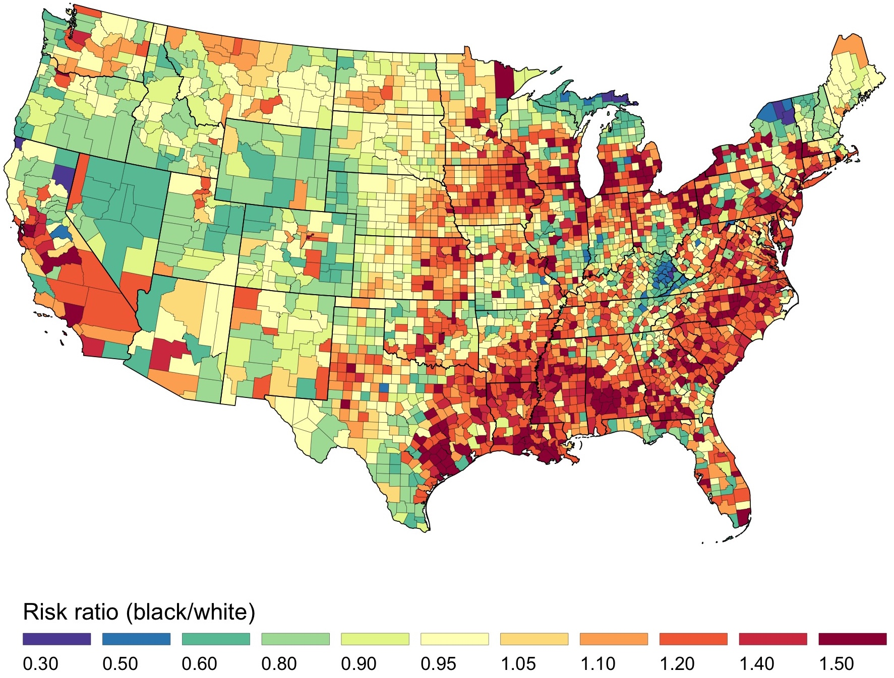

<!-- README.md is generated from README.Rmd. Please edit that file -->

# Decomposition of the US black/white inequality in premature mortality, , 2010–2015: an observational study

# Introduction

Code for our *BMJ Open* paper [“Decomposition of the US black/white
inequality in premature mortality, 2010–2015: an observational
study”](http://dx.doi.org/10.1136/bmjopen-2019-029373). This paper
uses joint Bayesian spatial models with [restricted-access compressed
mortality data](https://www.cdc.gov/nchs/data_access/cmf.htm) to
estimate and decompose black/white inequalities in premature mortality.
The full citation is:

> Kiang MV, Krieger N, Buckee CO, Onnela JP, & Chen JT, Decomposition of
> the US black/white inequality in premature mortality, 2010–2015: an
> observational study, *BMJ Open* (December 2019), doi:
> [10.1136/bmjopen-2019-029373](http://dx.doi.org/10.1136/bmjopen-2019-029373)

## Issues

Please submit issues [via
Github](https://github.com/mkiang/decomposing_inequality/issues) or via
email.

## Important note about reproducibility

Due to limitations on sharing the restricted-access data, this pipeline
is not fully reproducible. To reproduce the pipeline, you must have the
restricted-access compressed mortality files and the accompanying
population estimates. Specify the path to these files in the
`04_extracting_cmf_data.R` script in lines 64 and 72.

# Disclaimer

Since completion of this project, there have been significant advances
in the underlying software packages. For example, `stan` [now allows for
parallel processing *within a single
chain*](https://github.com/stan-dev/math/wiki/Threading-Support), which
should substantially reduce computation time. In addition, there has
been significant development in estimating a spatial conditional
autoregressive using `stan` (e.g.,
[`cor_car()`](https://rdrr.io/cran/brms/man/cor_car.html) in the `brms`
package). Members of the `stan` team themselves have [published an
example](https://doi.org/10.1016/j.sste.2019.100301) that did not exist
when this project was underway.

All that to say, this code should be considered a **starting point** for
future project development. Modernizing the code used in this project
will likely decrease the computational burden substantially.

# Requirements

## Restricted-access compressed mortality files

Request access to the compressed mortality files through the [National
Center for Health
Statistics](https://www.cdc.gov/nchs/data_access/cmf.htm).

## Software

All analyses are conducted using `R`.

  - `R` can be [downloaded via CRAN](https://cran.r-project.org/).
  - In addition, we highly recommend the use of
    [RStudio](https://www.rstudio.com/products/rstudio/download/) when
    running `R`.

# Analysis pipeline

The code is made to be run in sequential order.

Intermediate, publicly-available files (e.g., the ACS variables and
shapefiles) are included, so you should not need to update `config.yml`.
However, if you want to use other ACS variables, or start from scratch,
you will need to [request an API key](https://api.data.gov/signup/) from
the US Census Bureau and put it in the `config.yml` file. See
`./config.yml` for descriptions of project-wide parameters that can be
modified.

Code files beginning with `50_` were used internally for diagnostic
purposes but not included in the final manuscript.

# Acknowledgement

Special thanks to [Max Joseph](https://mbjoseph.github.io/) who freely
provided his [`stan` conditional autoregressive
code](https://github.com/mbjoseph/CARstan) online
([doi: 10.5281/zenodo.210407](https://doi.org/10.5281/zenodo.210407)).

Interested readers should see his [official `stan` case
study](https://mc-stan.org/users/documentation/case-studies/mbjoseph-CARStan.html),
another [ICAR `stan` case study
here](https://mc-stan.org/users/documentation/case-studies/icar_stan.html),
and a [paper using ICAR by members of the `stan`
team](https://doi.org/10.1016/j.sste.2019.100301).

# Authors

  - [Mathew Kiang](https://mathewkiang.com)
    (:
    [mkiang](https://github.com/mkiang) |
    :
    [@mathewkiang](https://twitter.com/mathewkiang))
  - [Nancy Krieger](https://www.hsph.harvard.edu/nancy-krieger/)
  - [Caroline Buckee](https://www.hsph.harvard.edu/caroline-buckee/)
    (:
    [@Caroline\_OF\_B](https://twitter.com/Caroline_OF_B))
  - [Jukka-Pekka Onnela](https://www.hsph.harvard.edu/onnela-lab/)
    (:
    [jponnela](https://github.com/jponnela) |
    :
    [@jponnela](https://twitter.com/jponnela))
  - [Jarvis
    Chen](http://www.dfhcc.harvard.edu/insider/member-detail/member/jarvis-t-chen-scd/)
